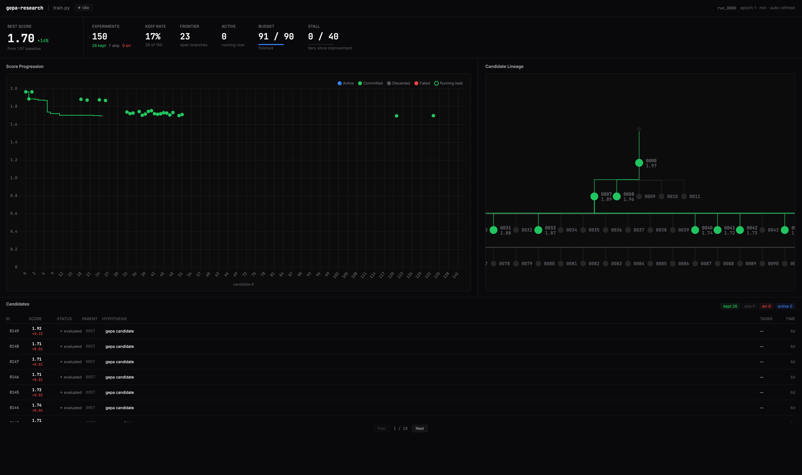

# GEPAResearch

A plugin for your agentic framework that optimizes code using the [GEPA](https://github.com/gepa-ai/gepa) algorithm (Genetic-Pareto LLM-driven search). Currently supported on [Claude Code](https://docs.anthropic.com/en/docs/claude-code), [Codex](https://developers.openai.com/codex), [OpenClaw](https://github.com/openclaw/openclaw), [Hermes](https://github.com/NousResearch/hermes-agent), and [Pi](https://pi.dev/) (`@mariozechner/pi-coding-agent`).

You give it a codebase. It discovers metrics to optimize, sets up the evaluation, and hands the search to GEPA -- a reflection-driven evolutionary optimizer that maintains a Pareto frontier of candidates and uses an LLM to propose targeted improvements from diagnostic feedback.

- **GEPA-backed search.** The optimization inner loop is [`gepa.optimize_anything`](https://github.com/gepa-ai/gepa): LLM-driven reflection over rich side-info, Pareto-efficient candidate selection, and automatic stall/budget handling.
- **Per-candidate git worktrees.** Every candidate GEPA proposes is applied in an isolated worktree and committed if it passes gates -- full audit trail, safe rollback.
- **Gating.** Regression tests or safety checks can be wired up as a gate. Candidates that fail the gate score 0.0 and are discarded.
- **Observability.** A local dashboard renders the candidate lineage DAG (from `GEPAResult.parents`) and per-task traces.
- **Benchmark discovery.** The `discover` skill explores the repo, figures out what to measure, and instruments the evaluation.



## Install

Common: `git`, [uv](https://docs.astral.sh/uv/), Python 3.10+.

### 1. Install the gepa-research CLI when your host does not expose the bundled wrapper

Claude Code bundles its own wrapper. The Pi package below also exposes the bundled wrapper through a tiny PATH extension. Codex, OpenClaw, Hermes, and Pi with that extension disabled call `gepa-research` as an external binary. The CLI is not published to PyPI -- install it directly from this GitHub repo (the package lives in the `plugins/gepa-research/` subdirectory):

```bash
uv tool install "git+https://github.com/CyrusNuevoDia/gepa-research#subdirectory=plugins/gepa-research"
# or: pipx install "git+https://github.com/CyrusNuevoDia/gepa-research#subdirectory=plugins/gepa-research"
gepa-research --version              # gepa-research-cli 0.1.0
```

To pin a release, append `@<tag>` to the repo URL (e.g. `...gepa-research@v0.1.0#subdirectory=...`).

### 2. Add the plugin

**Claude Code**

```
/plugin marketplace add CyrusNuevoDia/gepa-research
/plugin install gepa-research@CyrusNuevoDia-gepa-research
```

Invoke: `/gepa-research:discover`, `/gepa-research:optimize`.

**Codex** (requires 0.121.0-alpha.2 or newer -- `npm install -g @openai/codex@alpha` if you're on 0.120.0 stable)

```bash
codex marketplace add CyrusNuevoDia/gepa-research
```

Then `/plugins` → `gepa-research` → install. Invoke: `$gepa-research discover`, `$gepa-research optimize`.

**OpenClaw**

```bash
openclaw plugins install gepa-research --marketplace https://github.com/CyrusNuevoDia/gepa-research
```

Invoke: `/discover`, `/optimize`.

**Hermes** (per-skill install, no bundle support)

```bash
hermes skills install CyrusNuevoDia/gepa-research/plugins/gepa-research/skills/discover --force
hermes skills install CyrusNuevoDia/gepa-research/plugins/gepa-research/skills/optimize
```

`--force` on `discover` bypasses the SKILL.md scanner (it flags gepa-research's own install examples). Invoke: `/discover`, `/optimize`.

**Pi** (`@mariozechner/pi-coding-agent`)

```bash
pi install git:github.com/CyrusNuevoDia/gepa-research
# or, from a checkout:
pi install /path/to/gepa-research
```

The Pi package loads two wrapper skills and a tiny extension that prepends the bundled `plugins/gepa-research/bin/` wrappers to Pi's `PATH`. You still need `uv` installed because the wrapper runs the Python CLI with `uv run --project plugins/gepa-research`.

Invoke: `/skill:gepa-research-discover`, `/skill:gepa-research-optimize`.

## Usage

Two canonical skills:

- **`discover`** -- explores the repo, instruments the benchmark, runs baseline
- **`optimize`** -- hands the benchmark to GEPA and backports candidates into the local graph

Pi exposes namespaced wrapper skills (`gepa-research-discover`, `gepa-research-optimize`) that load these canonical skills, avoiding collisions with other packages' generic `discover` or `optimize` skills.

Invocation syntax depends on the host -- see the Install section above.

`optimize` accepts optional parameters:

| Parameter          | Default | Description                                                     |
| ------------------ | ------- | --------------------------------------------------------------- |
| `max-metric-calls` | 50      | Total evaluator calls GEPA may make this run                    |
| `stall`            | 5       | Consecutive iterations with no improvement before auto-stopping |

Example (Claude Code): `/gepa-research:optimize max-metric-calls=100 stall=10`. Pi uses `/skill:gepa-research-optimize max-metric-calls=100 stall=10`. Other hosts use their own invocation prefix.

Typical flow:

```
you: gepa-research:discover
gepa-research: explores repo, instruments benchmark, runs baseline

you: gepa-research:optimize
gepa-research: hands the seed candidate + evaluator to gepa.optimize_anything
               GEPA proposes mutations via LLM reflection over side-info
               each candidate is applied in an isolated git worktree, gate-checked, and committed on success
               runs until budget or stall limit reached
```

Under the hood, each GEPA candidate gets its own git worktree branching from its parent. If the score improves and the gate passes, the candidate is committed. Otherwise it's discarded and the worktree is cleaned up.

### Architecture

```
Orchestrator (this plugin):
  - reads current best committed candidate from .gepa-research/<run>/graph.json
  - assembles seed_candidate: dict[target_path -> file_contents]
  - calls gepa.optimize_anything(seed_candidate, evaluator=adapter.evaluate, ...)

  GepaResearchAdapter.evaluate (called by gepa per candidate):
    - allocates a git worktree for the candidate
    - writes candidate dict to target files
    - runs the benchmark subprocess, parses score, captures traces
    - runs gates; on failure returns (0.0, {"gate_failed": ..., "traces": ...})
    - commits the worktree on success; discards on failure
    - returns (score, side_info) back to GEPA

  GEPA (external library):
    - maintains Pareto frontier of candidates
    - selects parent candidate for next iteration
    - reflects on side_info via LLM, proposes targeted edits
    - stops on budget / stall / signal
```

## Dashboard

The dashboard starts automatically when you run `gepa-research:discover` (or `gepa-research init`). When it comes up, the agent surfaces the URL in the chat:

```
Dashboard live: http://127.0.0.1:8080 (pid 12345)
```

If `8080` is busy, gepa-research auto-increments (`8081`, `8082`, ...) and prints the actual port. You can also start it manually:

```bash
uv run --project /path/to/gepa-research/plugins/gepa-research gepa-research dashboard --port 8080
```

The chosen port is persisted to `.gepa-research/dashboard.port` so repeat runs re-use it.

## Dev install

For working on gepa-research itself (not just using it):

```bash
git clone https://github.com/CyrusNuevoDia/gepa-research
cd gepa-research
uv run --project plugins/gepa-research gepa-research --version   # gepa-research-cli 0.1.0
```

`uv run` resolves dependencies on first use -- no `pip install` step.

The Pi package metadata lives at the repo root (`package.json`) and exposes `pi/skills/` plus `pi/extensions/gepa-research-path.js` for `pi install git:github.com/CyrusNuevoDia/gepa-research`.

The SDKs live in separate packages:

- `sdk/python/` -- `gepa-research-agent`, Python 3.10+, zero deps. Tests: `cd sdk/python && uv run --with pytest pytest test/`.
- `sdk/node/` -- `gepa-research`, Node 18+, zero deps. Tests: `cd sdk/node && npm test`.

## TODO

- [ ] Distributed evaluation via [Harbor](https://github.com/harbor-framework/harbor) -- run benchmarks in containers instead of locally, use Harbor's cloud providers to parallelize.
- [ ] Pareto-frontier visualization in the dashboard using `GEPAResult.per_val_instance_best_candidates`.

## Acknowledgements

GEPAResearch is a fork of [evoresearch](https://github.com/evo-hq/evo).

## License

Licensed under the [Apache License 2.0](LICENSE).
